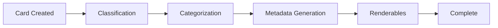
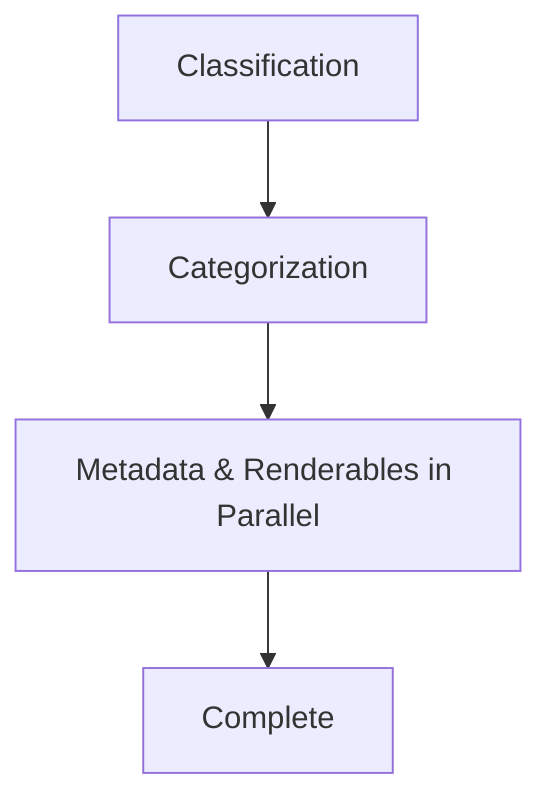
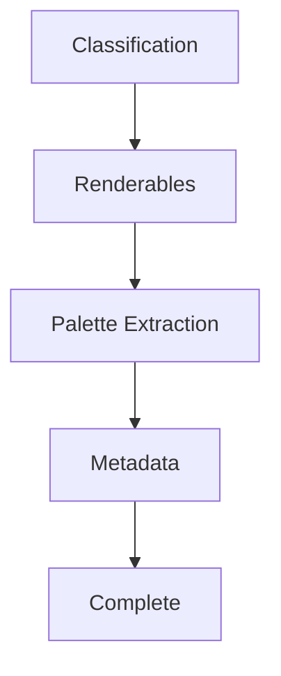
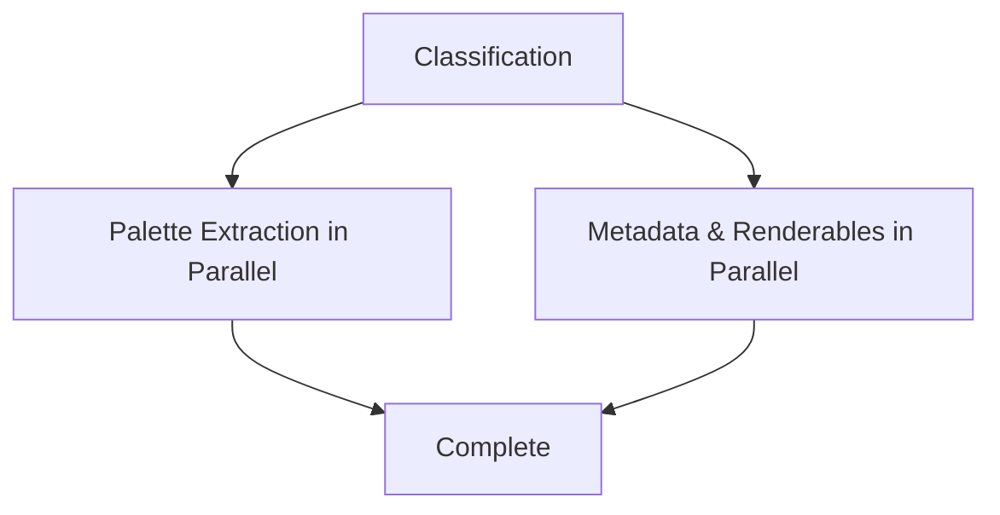

# AI Processing

Teak's AI processing pipeline automatically enriches your cards with metadata, tags, summaries, and transcripts. The system runs in the background after card creation, powered by Convex workflows with automatic retry logic.

## Processing Pipeline

Every new card enters a multi-stage processing workflow:



### Stage 1: Classification

Determines the card type if not explicitly provided.

**Input**: Card content, file metadata, URL patterns

**Output**:
```typescript
{
  type: "image",
  confidence: 0.95,
  needsLinkMetadata: false,
  shouldCategorize: false,
  shouldGenerateMetadata: true,
  shouldGenerateRenderables: true
}
```

**Process**:
1. Analyzes file extensions and MIME types
2. Examines URL patterns for links
3. Inspects content structure
4. Assigns confidence score
5. Determines subsequent pipeline steps

**Retry Configuration**: Uses default workflow retry behavior

### Stage 2: Categorization (Links Only)

Classifies link cards into specific categories and extracts rich metadata.

**Input**: Link URL, fetched page metadata

**Output**:
```typescript
{
  category: "article",
  confidence: 0.92,
  structuredData: { /* provider-specific data */ }
}
```

**Process**:
1. **Fetch Link Metadata**
   - Request page HTML
   - Parse Open Graph tags
   - Extract meta tags
   - Download and cache preview image
   - Capture screenshot (if applicable)

2. **Classify Category**
   - Analyze URL patterns (youtube.com → video)
   - Detect provider (GitHub, Medium, Twitter, etc.)
   - Use AI to classify content type
   - Assign confidence score

3. **Fetch Structured Data** (if applicable)
   - Query provider-specific APIs
   - Extract additional metadata
   - Normalize to standard format

4. **Merge and Save**
   - Combine all metadata sources
   - Update card record
   - Mark categorization stage complete

**Retry Configuration**:
```typescript
const LINK_METADATA_STEP_RETRY = {
  maxAttempts: 5,
  initialBackoffMs: 5000,
  base: 2
};

const LINK_ENRICHMENT_STEP_RETRY = {
  maxAttempts: 5,
  initialBackoffMs: 1200,
  base: 1.6
};
```

**Link Categories**:
- `article` - Blog posts, news, documentation
- `video` - YouTube, Vimeo, streaming content
- `product` - E-commerce, SaaS products
- `repository` - GitHub repos, code samples
- `design` - Dribbble, Behance, inspiration
- `social` - Twitter threads, LinkedIn posts
- `tool` - Web apps, utilities, services

### Stage 3: Metadata Generation

Generates AI tags, summaries, and transcripts.

**Input**: Card content, file data, link metadata

**Output**:
```typescript
{
  aiTags: ["react", "hooks", "javascript", "tutorial"],
  aiSummary: "A comprehensive guide to React Hooks...",
  aiTranscript: "[00:00] Welcome to this tutorial..." // audio/video only
}
```

**Process by Card Type**:

<Tabs>
  <Tab title="Text/Quote">
    **AI Tags**:
    - Topic extraction
    - Keyword identification
    - Theme classification

    **AI Summary**:
    - Key points extraction (for longer text)
    - Main ideas condensation
  </Tab>
  <Tab title="Link">
    **AI Tags**:
    - Analyze title + description
    - Extract topics from content
    - Combine with metadata

    **AI Summary**:
    - Synthesize page description
    - Highlight key points
    - Include context from metadata
  </Tab>
  <Tab title="Image">
    **AI Tags**:
    - Object detection
    - Scene classification
    - Concept extraction

    **AI Summary**:
    - Describe visual content
    - Identify subjects
    - Note composition elements

    **Visual Styles**:
    - Classify aesthetic (minimal, vibrant, etc.)
    - Detect mood (moody, cinematic, etc.)
    - Identify style (photographic, illustrative, etc.)
  </Tab>
  <Tab title="Video">
    **AI Transcript**:
    - Extract audio track
    - Speech-to-text conversion
    - Timestamp markers
    - Speaker detection

    **AI Tags**:
    - Topics from transcript
    - Visual elements
    - Scene analysis

    **AI Summary**:
    - Condense transcript
    - Key moments
    - Main topics
  </Tab>
  <Tab title="Audio">
    **AI Transcript**:
    - Full speech-to-text
    - Timestamp markers
    - Speaker identification
    - High accuracy transcription

    **AI Tags**:
    - Topic extraction
    - Keywords from speech
    - Content classification

    **AI Summary**:
    - Summarize transcript
    - Main discussion points
    - Key takeaways
  </Tab>
  <Tab title="Document">
    **AI Tags**:
    - Extract document topics
    - Identify key concepts
    - Classify document type

    **AI Summary**:
    - Summarize main content
    - Extract key sections
    - Highlight important points
  </Tab>
  <Tab title="Palette">
    **AI Tags**:
    - Color mood (warm, cool, etc.)
    - Style associations
    - Use case suggestions
  </Tab>
</Tabs>

**Retry Configuration**:
```typescript
const METADATA_STEP_RETRY = {
  maxAttempts: 8,
  initialBackoffMs: 400,
  base: 1.8
};
```

<Info>
Metadata generation has the highest retry count (8 attempts) because AI API calls can occasionally fail due to rate limits or temporary outages.
</Info>

### Stage 4: Renderables

Generates thumbnails and visual previews.

**Applies to**: Image, video, document cards

**Process**:

<Accordion title="Image Cards">
  1. Check if image is larger than thumbnail threshold
  2. Generate optimized thumbnail (max dimensions, compressed)
  3. Save to Convex storage
  4. Update card with `thumbnailId`

  **Special Case - SVG Images**:
  - Render SVG to raster format first
  - Generate thumbnail from rasterized version
  - Use thumbnail for palette extraction (SVGs need raster for color analysis)
</Accordion>

<Accordion title="Video Cards">
  1. Extract frame (first frame or middle frame)
  2. Generate thumbnail image
  3. Optimize and compress
  4. Save to Convex storage
  5. Update card with `thumbnailId`

  **Note**: For videos, renderables are generated BEFORE metadata extraction so the thumbnail is available for visual AI analysis.
</Accordion>

<Accordion title="Document Cards">
  1. Render first page/slide
  2. Generate preview image
  3. Optimize for display
  4. Save to Convex storage
  5. Update card with `thumbnailId`
</Accordion>

**Skip Conditions**:
- Image already smaller than thumbnail size
- File doesn't support thumbnail generation
- Previous thumbnail generation succeeded

### Palette Extraction (Images Only)

Runs in parallel with other processing stages for raster images, or after renderables for SVG images.

**Process**:
1. Load image (or thumbnail for SVGs)
2. Sample dominant colors
3. Extract color palette (5-8 colors)
4. Compute RGB and HSL values
5. Categorize into hue buckets
6. Save to card:

```typescript
colors: [
  {
    hex: "#8B7355",
    name: "Almond",
    rgb: { r: 139, g: 115, b: 85 },
    hsl: { h: 33, s: 24, l: 44 }
  },
  // ... more colors
],
colorHexes: ["#8B7355", "#D4A574", ...],
colorHues: ["brown", "orange", ...]
```

<Note>
Palette extraction failures are logged but don't fail the entire workflow. The card remains valid without color data.
</Note>

## Processing Status

Each card tracks processing progress:

```typescript
processingStatus: {
  classify: {
    status: "completed",
    startedAt: 1705334400000,
    completedAt: 1705334401234,
    confidence: 0.95
  },
  categorize: {
    status: "completed",
    startedAt: 1705334401234,
    completedAt: 1705334405678,
    confidence: 0.87
  },
  metadata: {
    status: "in_progress",
    startedAt: 1705334405678
  },
  renderables: {
    status: "pending"
  }
}
```

### Status Values

- `pending` - Stage not yet started
- `in_progress` - Currently running
- `completed` - Successfully finished
- `failed` - Error occurred (with `error` field)

### Confidence Scores

Classification and categorization stages include confidence scores:

- `0.9 - 1.0` - Very high confidence
- `0.7 - 0.89` - High confidence
- `0.5 - 0.69` - Medium confidence
- `< 0.5` - Low confidence (may need review)

## Workflow Implementation

The processing pipeline uses Convex workflows with retry logic:

```typescript
export const cardProcessingWorkflow = workflow.define({
  args: { cardId: v.id("cards") },
  returns: v.object({
    success: v.boolean(),
    classification: v.object({ type: v.string(), confidence: v.number() }),
    categorization: v.optional(v.object({ category: v.string(), confidence: v.number() })),
    metadata: v.object({
      aiTagsCount: v.number(),
      hasSummary: v.boolean(),
      hasTranscript: v.boolean()
    }),
    renderables: v.optional(v.object({ thumbnailGenerated: v.boolean() }))
  }),
  handler: async (step, { cardId }) => {
    // 1. Classification
    const classification = await step.runAction(
      internal.workflows.steps.classification.classify,
      { cardId }
    );

    // 2. Link metadata (if needed)
    if (classification.type === "link") {
      await step.runAction(
        internal.workflows.steps.linkMetadata.fetchMetadata,
        { cardId },
        { retry: LINK_METADATA_STEP_RETRY }
      );
    }

    // 3. Categorization (for links)
    let categorization;
    if (classification.shouldCategorize) {
      // Multi-step categorization with structured data
      categorization = await performCategorization(step, cardId);
    }

    // 4. Metadata & Renderables (parallel or sequential based on type)
    let metadataResult, renderablesResult;
    
    if (classification.type === "video" || isSvgImage) {
      // Sequential: renderables first, then metadata
      renderablesResult = await step.runAction(
        internal.workflows.steps.renderables.generate,
        { cardId, cardType: classification.type }
      );
      
      metadataResult = await step.runAction(
        internal.workflows.steps.metadata.generate,
        { cardId, cardType: classification.type },
        { retry: METADATA_STEP_RETRY }
      );
    } else {
      // Parallel: both at once
      [metadataResult, renderablesResult] = await Promise.all([
        step.runAction(
          internal.workflows.steps.metadata.generate,
          { cardId, cardType: classification.type },
          { retry: METADATA_STEP_RETRY }
        ),
        step.runAction(
          internal.workflows.steps.renderables.generate,
          { cardId, cardType: classification.type }
        )
      ]);
    }

    return {
      success: true,
      classification,
      categorization,
      metadata: metadataResult,
      renderables: renderablesResult
    };
  }
});
```

### Retry Behavior

Workflow steps automatically retry on failure:

| Stage | Max Attempts | Initial Backoff | Backoff Base |
|-------|-------------|----------------|-------------|
| Link Metadata | 5 | 5000ms | 2.0 |
| Categorization | 5 | 1200ms | 1.6 |
| Metadata Generation | 8 | 400ms | 1.8 |

**Backoff Calculation**:
```
delay = initialBackoffMs * (base ^ attemptNumber)
```

Example for metadata generation:
- Attempt 1: 400ms
- Attempt 2: 720ms (400 * 1.8)
- Attempt 3: 1,296ms (400 * 1.8²)
- Attempt 4: 2,333ms (400 * 1.8³)

<Warning>
If all retry attempts fail, the stage status is marked as "failed" with an error message. The card remains valid with partial processing complete.
</Warning>

## Execution Order

### Standard Flow (Text, Link, Document, Audio)



### Video/SVG Flow (Thumbnail Required)



This ensures the thumbnail is ready for visual AI analysis.

### Image Flow (Non-SVG)



Raster images can extract palettes immediately from the source file.

## Performance Considerations

### Processing Time Estimates

| Card Type | Avg Time | Notes |
|-----------|----------|-------|
| Text | 1-2 sec | Fast, minimal AI processing |
| Quote | 1-2 sec | Similar to text |
| Link | 5-15 sec | Depends on external site response time |
| Image | 3-8 sec | Includes palette extraction |
| Video | 10-30 sec | Thumbnail + transcription (if speech) |
| Audio | 5-20 sec | Depends on audio length |
| Document | 5-15 sec | Depends on page count |
| Palette | &lt;1 sec | No external processing |

### Resource Usage

- **File Storage**: Thumbnails typically 50-200KB
- **AI API Calls**: 1-3 calls per card (classification, tagging, summarization)
- **Workflow Executions**: 1 workflow per card

### Optimization Strategies

1. **Parallel Execution**: Metadata and renderables run simultaneously when possible
2. **Early Termination**: Skip stages that don't apply to card type
3. **Incremental Updates**: Save progress after each stage
4. **Graceful Degradation**: Failed stages don't block completion

## Monitoring Processing

You can monitor processing status in real-time:

```typescript
// Query card to check status
const card = await ctx.db.get(cardId);

if (card.processingStatus?.metadata?.status === "in_progress") {
  console.log("AI is currently generating metadata...");
}

if (card.processingStatus?.metadata?.status === "failed") {
  console.error("Metadata generation failed:", 
    card.processingStatus.metadata.error
  );
}
```

### Real-Time Updates

Convex provides real-time reactivity:

```typescript
// React hook automatically re-renders when processing completes
const card = useQuery(api.cards.getCard, { cardId });

{card.aiTags && (
  <div>Tags: {card.aiTags.join(", ")}</div>
)}

{card.aiSummary && (
  <div>Summary: {card.aiSummary}</div>
)}
```

UI automatically updates as each processing stage completes.

## Manual Triggers

In some cases, you may want to manually trigger reprocessing:

```typescript
// Reprocess a card (triggers full pipeline)
export const reprocessCard = mutation({
  args: { cardId: v.id("cards") },
  handler: async (ctx, args) => {
    // Reset processing status
    await ctx.db.patch(args.cardId, {
      processingStatus: {
        classify: { status: "pending" },
        categorize: { status: "pending" },
        metadata: { status: "pending" },
        renderables: { status: "pending" }
      }
    });
    
    // Start workflow
    await ctx.scheduler.runAfter(
      0,
      internal.workflows.cardProcessing.cardProcessingWorkflow,
      { cardId: args.cardId }
    );
  }
});
```

## Next Steps

<CardGroup cols={2}>
  <Card title="Card Types" icon="grid" href="/features/card-types">
    See what AI features apply to each type
  </Card>
  <Card title="Search" icon="search" href="/features/search">
    Search across AI-generated metadata
  </Card>
  <Card title="Workflows" icon="diagram-project" href="/development/workflows">
    Deep dive into workflow architecture
  </Card>
  <Card title="Schema" icon="database" href="/development/schema">
    Explore the complete card schema
  </Card>
</CardGroup>