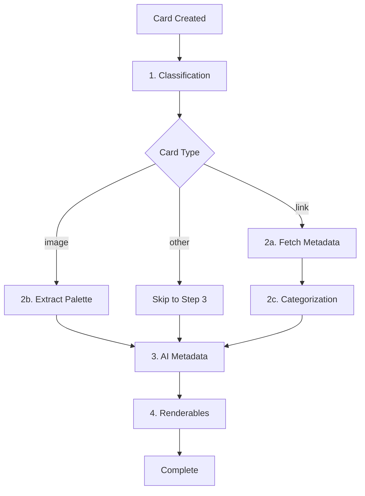

## Overview

Teak's AI pipeline automatically enriches cards with metadata, making them easier to search, organize, and rediscover. All processing happens asynchronously after card creation.

## Processing Workflow

When you create a card, it enters an automated AI workflow:



<Note>
The workflow is defined in `packages/convex/workflows/cardProcessing.ts:43-298`.
</Note>

## Step 1: Classification

Determines the card type if not explicitly provided.

<Steps>
  <Step title="Check Explicit Type">
    If `type` was provided at creation, skip classification:

    ```typescript
    {
      content: "My idea",
      type: "text" // Explicit type
    }
    // Classification: { type: "text", confidence: 1.0 }
    ```
  </Step>

  <Step title="Run AI Classifier">
    For ambiguous content, an AI model analyzes the content:

    ```typescript
    {
      content: "Check out this amazing tutorial video"
      // No type specified
    }
    // AI determines: { type: "link", confidence: 0.85 }
    ```
  </Step>
</Steps>

## Step 2: Link Processing

For link cards, Teak fetches rich metadata and categorizes the content.

### 2a. Metadata Extraction

Fetches Open Graph data, page title/description, and images:

```typescript
// Link card metadata structure
{
  metadata: {
    linkPreview: {
      title: "Understanding React Hooks",
      description: "A comprehensive guide to React Hooks...",
      imageUrl: "https://example.com/og-image.jpg",
      imageStorageId: "k1abc...",
      screenshotStorageId: "k2def...",
      status: "success"
    }
  },
  metadataTitle: "Understanding React Hooks",
  metadataDescription: "A comprehensive guide to React Hooks...",
  metadataStatus: "completed"
}
```

<Note>
Metadata extraction uses the workflow in `packages/convex/workflows/steps/linkMetadata/fetchMetadata.ts`.
</Note>

### 2b. Categorization

Classifies links into 15 categories:

<Tabs items={['Categories', 'Examples', 'Metadata']}>
  <Tab value="Categories">
    | Category | Description |
    | -------- | ----------- |
    | **book** | Books, eBooks |
    | **movie** | Movies, films |
    | **tv** | TV shows, series |
    | **article** | Long-form articles |
    | **news** | News briefs, updates |
    | **podcast** | Podcast episodes |
    | **music** | Music tracks, albums |
    | **product** | Shopping pages |
    | **recipe** | Recipes, cooking guides |
    | **course** | Courses, tutorials |
    | **research** | Research papers |
    | **event** | Events, webinars |
    | **software** | Software, apps, GitHub |
    | **design_portfolio** | Design portfolios |
    | **other** | Miscellaneous |
  </Tab>

  <Tab value="Examples">
    ```typescript
    // Book link
    {
      url: "https://amazon.com/book/...",
      metadata: {
        linkCategory: {
          category: "book",
          confidence: 0.95,
          detectedProvider: "amazon",
          sourceUrl: "https://amazon.com/..."
        }
      }
    }

    // GitHub repo
    {
      url: "https://github.com/facebook/react",
      metadata: {
        linkCategory: {
          category: "software",
          confidence: 1.0,
          detectedProvider: "github",
          sourceUrl: "https://github.com/..."
        }
      }
    }
    ```
  </Tab>

  <Tab value="Metadata">
    Categories can include structured data:

    ```typescript
    {
      metadata: {
        linkCategory: {
          category: "product",
          confidence: 0.9,
          facts: [
            { label: "Price", value: "$49.99" },
            { label: "Rating", value: "4.5/5" },
            { label: "Reviews", value: "1,234" }
          ],
          imageUrl: "https://...",
          raw: { /* provider-specific data */ }
        }
      }
    }
    ```
  </Tab>
</Tabs>

<Note>
Categories are defined in `packages/convex/shared/linkCategories.ts:1-116`.
</Note>

## Step 3: AI Metadata Generation

Generates tags, summaries, and transcripts based on card type.

### AI Tags

Automatically extracts relevant topics and keywords:

```typescript
{
  aiTags: [
    "react",
    "hooks",
    "javascript",
    "frontend",
    "web-development"
  ]
}
```

<Tip>
AI tags are searchable via the `search_ai_tags` index.
</Tip>

### AI Summary

Generates concise summaries for:

- **Links**: Summarizes page content
- **Videos**: Summarizes visual content
- **Documents**: Extracts key points
- **Audio**: Summarizes spoken content
- **Images**: Describes visual content

```typescript
{
  aiSummary: "A comprehensive guide covering useState, useEffect, and custom hooks in React. Includes practical examples and best practices for functional components."
}
```

<Note>
Summaries are searchable via the `search_ai_summary` index.
</Note>

### AI Transcript

Generates transcripts for audio and video content:

```typescript
{
  aiTranscript: "Welcome to this tutorial on React Hooks. Today we'll cover the basics of useState and useEffect...",
  type: "audio"
}
```

<Tip>
Transcripts make audio/video content fully searchable via the `search_ai_transcript` index.
</Tip>

## Step 4: Renderables

Generates thumbnails and visual assets.

### Thumbnail Generation

Applies to:

- **Videos**: Extracts first frame
- **Documents**: Renders first page
- **SVG Images**: Rasterizes for palette extraction

```typescript
{
  thumbnailId: "k3ghi...",
  thumbnailUrl: "https://..." // Generated by storage.getUrl()
}
```

<Note>
For SVGs, thumbnails enable color palette extraction which would otherwise fail on vector graphics.
</Note>

## Processing Status

Track AI processing progress:

```typescript
interface ProcessingStatus {
  classify: {
    status: "pending" | "running" | "completed" | "failed";
    startedAt?: number;
    completedAt?: number;
    confidence?: number;
  };
  categorize?: {
    status: "pending" | "running" | "completed" | "failed";
    startedAt?: number;
    completedAt?: number;
  };
  metadata: {
    status: "pending" | "running" | "completed" | "failed";
    startedAt?: number;
    completedAt?: number;
  };
  renderables?: {
    status: "pending" | "running" | "completed" | "failed";
    startedAt?: number;
    completedAt?: number;
  };
}
```

### Querying Status

```typescript
const card = useQuery(api.cards.getCard, { cardId });

if (card?.processingStatus?.metadata?.status === "running") {
  // Show loading indicator
} else if (card?.processingStatus?.metadata?.status === "completed") {
  // Display AI tags and summary
}
```

## Retry Logic

Teak uses exponential backoff for resilient processing:

| Step | Max Attempts | Initial Backoff | Base |
| ---- | ------------ | --------------- | ---- |
| Classification | 8 | 400ms | 1.8 |
| Link Metadata | 5 | 5000ms | 2.0 |
| Categorization | 5 | 1200ms | 1.6 |
| AI Metadata | 8 | 400ms | 1.8 |

<Note>
Retry configuration is in `packages/convex/workflows/cardProcessing.ts:19-33`.
</Note>

## AI Provider Configuration

Teak's AI features use OpenAI models (configurable via environment variables):

```bash
# .env.local
OPENAI_API_KEY=sk-...
```

<Warning>
AI features require valid API keys. Cards will fail gracefully if keys are missing.
</Warning>

## Performance Considerations

<Steps>
  <Step title="Parallel Processing">
    For most cards, metadata and renderables run in parallel:

    ```typescript
    // From cardProcessing.ts:241-260
    const [metadataResult, renderablesResult] = await Promise.all([
      step.runAction(metadata.generate, { cardId }),
      step.runAction(renderables.generate, { cardId })
    ]);
    ```
  </Step>

  <Step title="Sequential for Videos">
    Videos need thumbnails before AI analysis:

    ```typescript
    // Generate thumbnail first
    const renderablesResult = await step.runAction(
      renderables.generate,
      { cardId }
    );

    // Then run AI metadata (uses thumbnail)
    const metadataResult = await step.runAction(
      metadata.generate,
      { cardId }
    );
    ```
  </Step>

  <Step title="Palette Extraction">
    Images get palette extraction in parallel with other processing:

    ```typescript
    // Runs alongside metadata generation
    const palettePromise = step.runAction(
      extractPaletteFromImage,
      { cardId }
    );
    ```
  </Step>
</Steps>

## Disabling AI Features

Currently, AI processing is automatic and cannot be disabled per-card. This may change in future versions.

<Tip>
If you want to skip AI processing, you can check `processingStatus` and only show AI fields when `status === "completed"`.
</Tip>

## Best Practices

<Steps>
  <Step title="Provide Context in Notes">
    The `notes` field helps AI generate better tags and summaries:

    ```typescript
    await createCard({
      content: "Design inspiration",
      url: "https://dribbble.com/shots/...",
      notes: "Minimal UI design for a productivity app, focus on the sidebar navigation"
    });
    ```
  </Step>

  <Step title="Use User Tags to Supplement AI">
    Combine manual tags with AI tags:

    ```typescript
    {
      tags: ["work", "urgent"], // Manual organization
      aiTags: ["react", "typescript", "frontend"] // AI-generated
    }
    ```
  </Step>

  <Step title="Monitor Processing Status">
    Show loading states while AI processes:

    ```typescript
    {card.processingStatus?.metadata?.status === "running" && (
      <Spinner>Generating AI tags...</Spinner>
    )}
    ```
  </Step>
</Steps>

## Source Reference

- Main workflow: `packages/convex/workflows/cardProcessing.ts:43-298`
- Link metadata: `packages/convex/linkMetadata.ts`
- Link categories: `packages/convex/shared/linkCategories.ts`
- Processing status: `packages/convex/card/processingStatus.ts`
