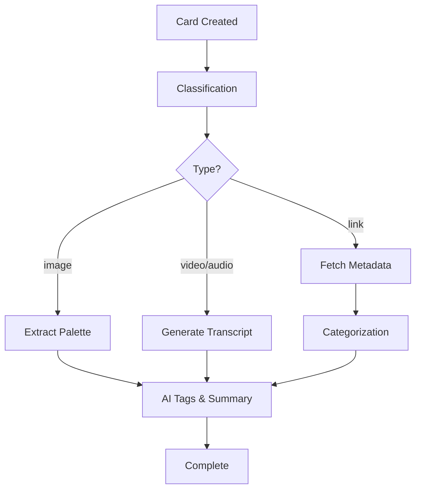

## Overview

Teak supports 8 card types: **text**, **link**, **image**, **video**, **audio**, **document**, **palette**, and **quote**. You can either specify the type explicitly or let Teak automatically detect it.

## Card Types

<Tabs items={['Text', 'Link', 'Image', 'Video', 'Audio', 'Document', 'Palette', 'Quote']}>
  <Tab value="Text">
    Basic text notes and ideas.

    ```typescript
    {
      content: "My brilliant idea",
      type: "text"
    }
    ```
  </Tab>

  <Tab value="Link">
    Web URLs with automatic metadata extraction.

    ```typescript
    {
      content: "Check this out",
      url: "https://example.com",
      type: "link"
    }
    ```

    <Note>
      Link cards automatically fetch:
      - Page title and description
      - Open Graph images
      - Category classification (book, article, product, etc.)
      - Provider-specific structured data
    </Note>
  </Tab>

  <Tab value="Image">
    Photos, illustrations, and visual content.

    ```typescript
    {
      content: "Sunset photo",
      type: "image",
      fileId: storageId
    }
    ```

    <Tip>
      SVG images automatically get thumbnail generation for palette extraction.
    </Tip>
  </Tab>

  <Tab value="Video">
    Video files with automatic thumbnail generation.

    ```typescript
    {
      content: "Tutorial video",
      type: "video",
      fileId: storageId,
      metadata: {
        duration: 180,
        width: 1920,
        height: 1080
      }
    }
    ```
  </Tab>

  <Tab value="Audio">
    Audio recordings and voice memos.

    ```typescript
    {
      content: "Meeting notes",
      type: "audio",
      fileId: storageId,
      metadata: {
        duration: 300
      }
    }
    ```
  </Tab>

  <Tab value="Document">
    PDFs and document files.

    ```typescript
    {
      content: "Research paper",
      type: "document",
      fileId: storageId,
      metadata: {
        fileName: "paper.pdf",
        fileSize: 1024000
      }
    }
    ```
  </Tab>

  <Tab value="Palette">
    Color palettes extracted from hex codes or text.

    ```typescript
    {
      content: "Sunset palette",
      type: "palette",
      colors: [
        { hex: "#FF6B35", name: "Coral" },
        { hex: "#F7931E", name: "Orange" },
        { hex: "#FDC830", name: "Yellow" }
      ]
    }
    ```

    <Note>
      If you don't provide colors, Teak automatically extracts them from the content, notes, or tags.
    </Note>
  </Tab>

  <Tab value="Quote">
    Inspirational quotes and excerpts.

    ```typescript
    {
      content: "Be the change you wish to see",
      type: "quote"
    }
    ```

    <Tip>
      Wrap text in quotes (") and Teak will auto-detect it as a quote card.
    </Tip>
  </Tab>
</Tabs>

## Auto-Detection

When you omit the `type` parameter, Teak uses intelligent classification:

<Steps>
  <Step title="URL Extraction">
    If the content contains a URL, it's extracted and cleaned:

    ```typescript
    // Input
    { content: "Check out https://example.com - really cool!" }

    // Processed
    {
      content: "Check out - really cool!",
      url: "https://example.com",
      type: "link" // auto-detected
    }
    ```
  </Step>

  <Step title="Quote Detection">
    Text wrapped in quotation marks becomes a quote:

    ```typescript
    // Input
    { content: '"To be or not to be"' }

    // Processed
    {
      content: "To be or not to be",
      type: "quote" // auto-detected
    }
    ```
  </Step>

  <Step title="File Type Detection">
    When a `fileId` is provided, MIME type determines the card type:

    | MIME Type | Card Type |
    | --------- | --------- |
    | image/* | image |
    | video/* | video |
    | audio/* | audio |
    | application/pdf | document |
  </Step>

  <Step title="AI Classification">
    For ambiguous cases, an AI classifier analyzes the content and assigns the most appropriate type with a confidence score.
  </Step>
</Steps>

## Creating Cards

### From Code

```typescript
import { api } from "@teak/convex";
import { useMutation } from "convex/react";

function MyComponent() {
  const createCard = useMutation(api.card.createCard.createCard);

  const handleCreate = async () => {
    await createCard({
      content: "My new card",
      type: "text",
      tags: ["ideas", "todo"],
      notes: "Additional context here"
    });
  };
}
```

### With Files

<Steps>
  <Step title="Upload to Storage">
    ```typescript
    const fileId = await storage.upload(file);
    ```
  </Step>

  <Step title="Create Card with File Reference">
    ```typescript
    await createCard({
      content: "My uploaded file",
      fileId: fileId,
      type: "image", // or let auto-detection handle it
      metadata: {
        fileName: file.name,
        fileSize: file.size,
        mimeType: file.type
      }
    });
    ```
  </Step>
</Steps>

## Metadata Fields

All cards support these optional fields:

| Field | Type | Description | Example |
| ----- | ---- | ----------- | ------- |
| `content` | string | Main text content | `"My idea"` |
| `type` | CardType | Card type (optional) | `"text"` |
| `url` | string | Associated URL | `"https://..."` |
| `fileId` | Id&lt;"_storage"&gt; | Convex storage ID | `k1abc...` |
| `thumbnailId` | Id&lt;"_storage"&gt; | Custom thumbnail | `k2def...` |
| `tags` | string[] | User tags | `["work", "urgent"]` |
| `notes` | string | Additional notes | `"Follow up next week"` |
| `metadata` | object | Custom metadata | `{ source: "email" }` |
| `colors` | Color[] | Palette colors | `[{ hex: "#FF0000" }]` |

## Processing Pipeline

After creation, cards enter an automated processing workflow:



<Note>
All processing happens asynchronously. You can query `processingStatus` to track progress.
</Note>

## Rate Limits

Teak enforces creation limits to ensure quality:

- **Free tier**: 200 cards maximum
- **Rate limiting**: Prevents spam creation

```typescript
// Rate limit error example
try {
  await createCard({ content: "Card" });
} catch (error) {
  if (error.code === "CARD_LIMIT_REACHED") {
    // Show upgrade prompt
  } else if (error.code === "RATE_LIMITED") {
    // Show "slow down" message
  }
}
```

## Best Practices

<Tip>
  **Let auto-detection work for you**: Omit `type` for simpler code and smarter classification.
</Tip>

<Tip>
  **Include context in notes**: The `notes` field helps AI generate better tags and summaries.
</Tip>

<Warning>
  **File size limit**: Maximum 20MB per file. Check `MAX_FILE_SIZE` constant.
</Warning>

<Tip>
  **Batch uploads**: Use `MAX_FILES_PER_UPLOAD` (5 files) to create multiple cards efficiently.
</Tip>

## Source Reference

The card creation logic is in:
- `packages/convex/card/createCard.ts:61-189` - Main handler
- `packages/convex/workflows/cardProcessing.ts:43-298` - Processing workflow
