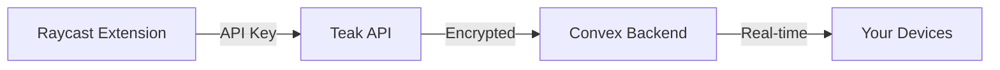

The Teak Raycast extension brings your personal knowledge hub directly into Raycast, enabling ultra-fast capture and search without leaving your keyboard.

## Overview

Built specifically for Raycast on macOS, this extension provides keyboard-first access to your Teak vault with three powerful commands.

<CardGroup cols={2}>
  <Card title="Technology Stack" icon="code">
    - Raycast API 1.104+
    - React components
    - Raycast Utils
    - Teak API integration
  </Card>
  <Card title="Platform" icon="apple">
    - macOS only
    - Raycast required
    - Keyboard-first workflow
    - Native macOS integration
  </Card>
</CardGroup>

## Commands

The extension provides three focused commands:

<AccordionGroup>
  <Accordion title="Quick Save" icon="plus">
    **Capture text or links to Teak without leaving your workflow**
    
    - Paste or type any content
    - Automatically detects URLs
    - Instant save with feedback
    - Duplicate detection
    - No context switching required
    
    ```bash
    # Default Raycast shortcut (customizable)
    ⌘ + Space → Quick Save
    ```
    
    Perfect for:
    - Saving links while browsing
    - Capturing quick notes
    - Storing URLs from Slack/Email
    - Recording fleeting thoughts
  </Accordion>
  <Accordion title="Search Cards" icon="magnifying-glass">
    **Find anything in your Teak vault instantly**
    
    - Full-text search across all cards
    - Search by content, tags, or metadata
    - Real-time results as you type
    - Open cards in Teak web app
    - Copy card content to clipboard
    
    ```bash
    # Launch search
    ⌘ + Space → Search Cards
    ```
    
    Search capabilities:
    - Card titles and content
    - AI-generated summaries
    - Tags and categories
    - URLs and metadata
  </Accordion>
  <Accordion title="Favorites" icon="star">
    **Access your saved favorites lightning fast**
    
    - Browse favorited cards
    - Instant access to important items
    - Open in web app or copy
    - Keyboard navigation
    
    ```bash
    # Access favorites
    ⌘ + Space → Favorites
    ```
    
    Ideal for:
    - Frequently referenced links
    - Important notes
    - Go-to resources
    - Quick reference materials
  </Accordion>
</AccordionGroup>

## Installation

### Prerequisites

<Steps>
  <Step title="Install Raycast">
    Download and install [Raycast](https://raycast.com) (free):
    
    ```bash
    # Via Homebrew
    brew install --cask raycast
    ```
  </Step>
  <Step title="Get API Key">
    Generate an API key from Teak:
    
    1. Open [Teak Settings](https://teakvault.com/settings)
    2. Navigate to **API Keys**
    3. Click **Generate New Key**
    4. Copy the key (shown once)
  </Step>
</Steps>

### Install Extension

<Tabs>
  <Tab title="Raycast Store">
    <Steps>
      <Step title="Open Raycast Store">
        1. Open Raycast (`⌘ + Space`)
        2. Type "Store"
        3. Press Enter
      </Step>
      <Step title="Search for Teak">
        Search for "Teak" in the extension store
      </Step>
      <Step title="Install">
        Click Install and follow the prompts
      </Step>
      <Step title="Configure API Key">
        Paste your API key when prompted
      </Step>
    </Steps>
  </Tab>
  <Tab title="Developer Mode">
    <Steps>
      <Step title="Clone & Build">
        ```bash
        # Clone repository
        cd apps/raycast
        
        # Install dependencies
        bun install
        
        # Build extension
        bun run build
        ```
      </Step>
      <Step title="Import to Raycast">
        1. Open Raycast
        2. Go to Extensions
        3. Click "+" → Import Extension
        4. Select the raycast directory
      </Step>
      <Step title="Configure">
        Add your API key in extension preferences
      </Step>
    </Steps>
  </Tab>
</Tabs>

## Configuration

### API Key Setup

The extension requires an API key to communicate with your Teak account:

<Steps>
  <Step title="Generate Key">
    In Teak web app:
    
    **Settings → API Keys → Generate New Key**
  </Step>
  <Step title="Add to Raycast">
    In Raycast:
    
    1. Open Raycast preferences (`⌘ + ,`)
    2. Go to Extensions → Teak
    3. Paste your API key
    4. Save
  </Step>
  <Step title="Verify">
    Test the connection:
    
    ```bash
    # Try Quick Save command
    ⌘ + Space → Quick Save
    # Type something and save
    ```
  </Step>
</Steps>

<Note>
API keys are stored securely in your macOS Keychain. They never leave your device except to authenticate with Teak's API.
</Note>

### Keyboard Shortcuts

Customize shortcuts for each command:

1. Open Raycast Preferences
2. Go to Extensions → Teak
3. Click on a command
4. Set your preferred keyboard shortcut

<Card title="Recommended Shortcuts" icon="keyboard">
  - Quick Save: `⌥ + ⌘ + S`
  - Search Cards: `⌥ + ⌘ + F`
  - Favorites: `⌥ + ⌘ + D`
</Card>

## Development

### Setup

<CodeGroup>

```bash Development
# Install dependencies
bun install

# Start development server
bun run dev

# Build for production
bun run build
```

```bash Quality Checks
# Type checking
bun run typecheck

# Linting
bun run lint

# Fix lint issues
bun run lint:fix

# Tests
bun run test
```

</CodeGroup>

### Project Structure

```
raycast/
├── src/
│   ├── quick-save.tsx       # Quick Save command
│   ├── search-cards.tsx     # Search command
│   ├── favorites.tsx        # Favorites command
│   ├── lib/
│   │   ├── api.ts           # Teak API client
│   │   └── preferences.ts   # Extension preferences
│   ├── components/
│   │   ├── MissingApiKeyDetail.tsx
│   │   └── SetApiKeyAction.tsx
│   └── __tests__/           # Test files
├── assets/
│   └── icon.png             # Extension icon
└── package.json             # Extension manifest
```

### API Integration

The extension uses the Teak API for all operations:

```typescript lib/api.ts
import { getPreferences } from "./preferences";

export async function quickSaveCard(content: string) {
  const { apiKey } = getPreferences();
  
  const response = await fetch("https://api.teakvault.com/cards", {
    method: "POST",
    headers: {
      "Authorization": `Bearer ${apiKey}`,
      "Content-Type": "application/json",
    },
    body: JSON.stringify({ content }),
  });
  
  return response.json();
}
```

### Command Implementation

Each command is a separate React component:

```typescript quick-save.tsx
import { Action, ActionPanel, Form, showToast } from "@raycast/api";
import { quickSaveCard } from "./lib/api";

export default function QuickSaveCommand() {
  const handleSubmit = async (values: { content: string }) => {
    try {
      await quickSaveCard(values.content);
      await showToast({ title: "Saved to Teak" });
    } catch (error) {
      await showToast({ 
        title: "Save failed", 
        message: error.message 
      });
    }
  };
  
  return (
    <Form
      actions={
        <ActionPanel>
          <Action.SubmitForm onSubmit={handleSubmit} />
        </ActionPanel>
      }
    >
      <Form.TextArea
        id="content"
        title="Content"
        placeholder="Paste or type text, links, or notes..."
      />
    </Form>
  );
}
```

## Features in Detail

### Quick Save

The Quick Save command provides instant content capture:

<Tabs>
  <Tab title="Text">
    Save quick notes and thoughts:
    
    ```
    Remember to check the quarterly reports
    ```
    
    - Saved as text card
    - AI summary generated
    - Searchable immediately
  </Tab>
  <Tab title="URLs">
    Save web links with automatic metadata:
    
    ```
    https://example.com/article
    ```
    
    - Automatic title extraction
    - Open Graph metadata
    - Favicon and preview
    - Duplicate detection
  </Tab>
  <Tab title="Mixed">
    Save notes with embedded links:
    
    ```
    Check out this article: https://example.com
    Great insights on productivity
    ```
    
    - Smart link detection
    - Preserves context
    - Full-text searchable
  </Tab>
</Tabs>

### Search Cards

Powerful search with real-time results:

```typescript
// Search implementation
const { data, isLoading } = useSearch(
  async (query) => {
    return await searchCards(query);
  },
  [searchQuery]
);
```

**Search features:**

- Instant results as you type
- Fuzzy matching
- Search across all card types
- Filter by favorites, tags, or date
- Preview card content
- Open in Teak or copy to clipboard

### Favorites

Quick access to your starred content:

```typescript
// Favorites list
const favorites = await getFavorites();

return (
  <List>
    {favorites.map(card => (
      <List.Item
        key={card.id}
        title={card.title}
        actions={
          <ActionPanel>
            <Action.OpenInBrowser url={card.url} />
            <Action.CopyToClipboard content={card.content} />
          </ActionPanel>
        }
      />
    ))}
  </List>
);
```

## Performance

### Optimization

The extension is optimized for speed:

- **Lazy loading**: Commands load only when needed
- **Caching**: Recent searches cached locally
- **Debouncing**: Search queries debounced (300ms)
- **Minimal bundle**: ~50KB total size

### Response Times

- **Quick Save**: &lt;500ms
- **Search**: &lt;200ms (cached), &lt;1s (new query)
- **Favorites**: &lt;300ms

## Error Handling

The extension provides clear error messages:

```typescript
try {
  await quickSaveCard(content);
} catch (error) {
  if (error.code === "UNAUTHORIZED") {
    showToast({
      style: Toast.Style.Failure,
      title: "Authentication failed",
      message: "Check your API key in extension preferences"
    });
  }
}
```

<AccordionGroup>
  <Accordion title="Invalid API Key">
    **Error**: "Authentication failed"
    
    **Solution**: 
    1. Generate a new API key in Teak settings
    2. Update in Raycast preferences
    3. Try again
  </Accordion>
  <Accordion title="Network Error">
    **Error**: "Failed to connect to Teak"
    
    **Solution**:
    - Check internet connection
    - Verify api.teakvault.com is accessible
    - Check firewall settings
  </Accordion>
  <Accordion title="Card Limit Reached">
    **Error**: "Upgrade required"
    
    **Solution**:
    - Upgrade your Teak plan
    - Delete old cards
    - Check billing settings
  </Accordion>
</AccordionGroup>

## Privacy & Security

<Card title="Privacy First" icon="shield">
  - API key stored in macOS Keychain
  - No telemetry or analytics
  - Direct communication with Teak API only
  - No third-party services
  - Open source code
</Card>

### Data Flow



All communication is encrypted (HTTPS) and authenticated with your personal API key.

## Publishing

To publish the extension to the Raycast Store:

<Steps>
  <Step title="Prepare">
    Ensure all metadata is complete:
    
    ```json package.json
    {
      "name": "teak-raycast",
      "title": "Teak",
      "description": "Save ideas fast, search your Teak cards...",
      "icon": "icon.png",
      "author": "praveenjuge",
      "categories": ["Productivity"]
    }
    ```
  </Step>
  <Step title="Build">
    ```bash
    bun run build
    ```
  </Step>
  <Step title="Publish">
    ```bash
    bun run publish
    ```
    
    Follow Raycast's review process
  </Step>
</Steps>

## Troubleshooting

<AccordionGroup>
  <Accordion title="Extension Not Loading">
    1. Check Raycast version (requires 1.50+)
    2. Reinstall extension
    3. Check console for errors: `⌘ + ⌥ + I` in Raycast
    4. Verify package.json is valid
  </Accordion>
  <Accordion title="Commands Not Appearing">
    1. Rebuild extension: `bun run build`
    2. Refresh Raycast: `⌘ + R`
    3. Check extension is enabled in preferences
    4. Reinstall if necessary
  </Accordion>
  <Accordion title="Slow Performance">
    1. Clear Raycast cache
    2. Reduce search result limit
    3. Check network latency
    4. Update to latest version
  </Accordion>
</AccordionGroup>

## Roadmap

Planned features for future releases:

<CardGroup cols={2}>
  <Card title="Offline Support" icon="wifi">
    Cache recent cards for offline access
  </Card>
  <Card title="Quick Look" icon="eye">
    Preview cards without opening web app
  </Card>
  <Card title="Tags" icon="tags">
    Add tags during quick save
  </Card>
  <Card title="Templates" icon="file">
    Save with predefined templates
  </Card>
</CardGroup>

## Learn More

<CardGroup cols={2}>
  <Card title="API Reference" icon="code" href="/api/overview">
    Learn about Teak's API
  </Card>
  <Card title="Web App" icon="globe" href="/platforms/web">
    Explore the Teak web application
  </Card>
  <Card title="Raycast" icon="arrow-up-right-from-square" href="https://developers.raycast.com">
    Official Raycast developer docs
  </Card>
  <Card title="Get Raycast" icon="arrow-up-right-from-square" href="https://raycast.com">
    Download Raycast for macOS
  </Card>
</CardGroup>